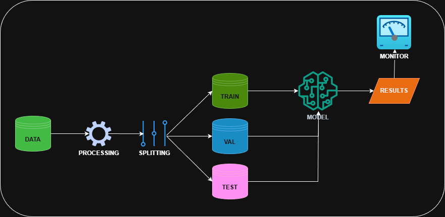

# 🚀 Hướng Dẫn Sử Dụng Pipeline Training
Xây dựng đường ống huấn luyện mô hình phân loại ảnh trên google colab với efficientnet-b03

# 🔧 Các gói thư viện cần thiết
+ torch 
+ torchvision 
+ tensorboard 
+ scikit-learn 
+ pandas 
+ matplotlib 
+ seaborn 
+ tqdm 
+ pillow

# 🔧 Cài đặt môi trường cho google colab
!pip install torch torchvision torchaudio --index-url https://download.pytorch.org/whl/cu118  
!pip install tensorboard scikit-learn pandas matplotlib seaborn tqdm pillow  

# 🔧 Cài đặt môi trường cho trường hợp chạy local
pip install -r requirements.txt

# 📁 Chuẩn bị cấu trúc dữ liệu
data/  
├── train/  
│   ├── class_01/  
│   │   ├── image_001.jpg  
│   │   ├── image_002.jpg  
│   │   └── ...  
│   ├── class_02/  
│   │   └── ...  
│   └── class_N/  
│       └── ...  
├── valid/  
│   ├── class_01/  
│   ├── class_02/  
│   └── class_N/  
└── test/  
    ├── class_01/  
    ├── class_02/  
    └── class_N/  

# 🎯 Cấu hình tham số
+ train_dir: đường dẫn thư mục dữ liệu huấn luyện
+ val_dir: đường dẫn thư mục xác thực
+ test_dir: đường dẫn thư mục kiểm thử
+ checkpoint_dir: đường dẫn lưu mô hình
+ log_dir: đường dẫn lưu logs
+ tensorboard_dir: đường dẫn lưu runs
+ num_classes: số lượng lớp
+ batch_size: số batch
+ num_epochs: số lần huấn luyện
+ learning_rate: tốc độ học
+ weight_decay: tham số decay
+ img_size: kích thước ảnh
+ use_mixed_precision: tăng tốc gpu
+ early_stopping: phương thức tránh overfitting
+ patience: số lần đợi
+ pretrained: tải trọng số

# ⚡ Quick Start
1. Trên kaggle: pipeline.ipynb
2. Trên local: pipeline.py

# 📊 Monitoring với TensorBoard
1. Trên google colab/kaggle:   
%load_ext tensorboard  
%tensorboard --logdir runs  

2. Trên local:  
tensorboard --logdir runs  
Mở browser: http://localhost:6006 